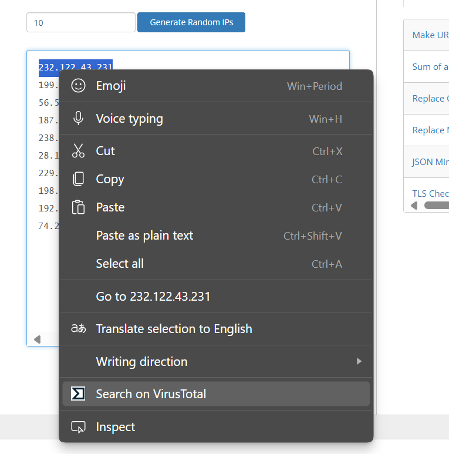

# 🔍 VT Validator Extension

A lightweight browser extension to **quickly search URLs, file hashes, domains, or IPs on [VirusTotal](https://www.virustotal.com)** via right-click — no API key required!

---

## 🚀 Features

- Right-click selected text and instantly search it on VirusTotal  
- Supports:
  - URLs
  - File hashes (MD5, SHA1, SHA256)
  - IP addresses
  - Domains  
- No API key or login required  
- Fast, privacy-respecting, and easy to use

---

## 📦 How to Install

1. **Download** or **clone** this repository.
2. Open your browser extensions page:
   - `chrome://extensions/` for **Google Chrome**
   - `edge://extensions/` for **Microsoft Edge**
3. **Enable Developer mode** (top right corner).
4. Click **"Load unpacked"**.
5. Select the folder containing the extension files (e.g., `VT_Validator_Extension/`).
6. Done! Now:
   - **Highlight any text** (URL, hash, domain, or IP)
   - **Right-click** → Choose **“Search on VirusTotal”**

### 🖱️ Right-Click Menu on Selected Text
  

  

---

## 📝 Notes

- Works on any **Chromium-based browser**: Chrome, Edge, Brave, Opera, etc.
- Make sure the following files exist:
  - `manifest.json`
  - `background.js`
  - `icons/icon.png`

---

## 🛡️ Disclaimer

This extension simply redirects your selected input to VirusTotal's public search.  
It does **not collect, store, or process** any personal data.

---

✅ Happy Hunting!
